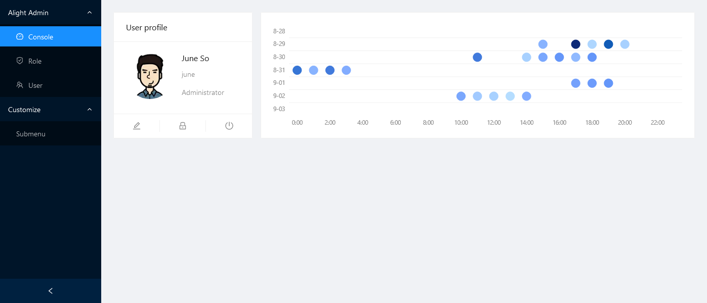
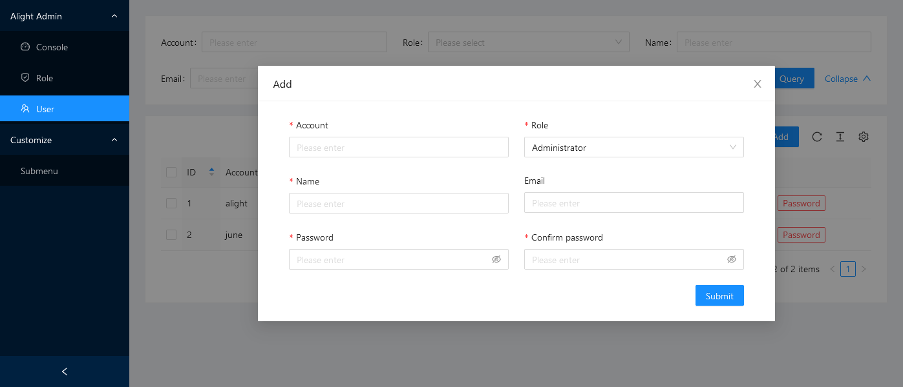

# Alight Admin
Alight Admin is a quick admin panel extension based on the  [Alight framework](https://github.com/juneszh/alight).





## Features
* **No front-end coding required**. Built-in **Ant Design UI** (React) components and driven by PHP interface.
* Quickly build and easily configure **CRUD** pages with Table/From render.
* Includes **authorization**, **permissions** and **user management**.
* Customizable **Charts** displayed in the console by PHP, such as **Line**, **Column**, **Pie**, etc.

## Usage
Alight Admin can be quickly built using [Alight Project](https://github.com/juneszh/alight-project).
### Creating Project
```bash
$ composer create-project juneszh/alight-project {PROJECT_DIRECTORY} 
```

### Initialize Admin
The following commands will build the runtime environment required by **Alight Admin**, such as installing composer package, inserting configuration options, creating database tables, and downloading front-end resources. Please make sure the [database has been configured](https://github.com/juneszh/alight#database).
```bash
$ cd {PROJECT_DIRECTORY} 
$ composer require juneszh/alight-admin
$ composer run-script admin-install
```

## Credits
* Composer requires
    * [gregwar/captcha](https://github.com/Gregwar/Captcha)
    * [symfony/var-exporter](https://github.com/symfony/var-exporter)
* UI components
    * [Ant Design](https://ant.design/)
    * [Ant Design Pro Components](https://procomponents.ant.design/)
    * [Ant Design Charts](https://charts.ant.design/en)

## License
* [MIT license](./LICENSE)