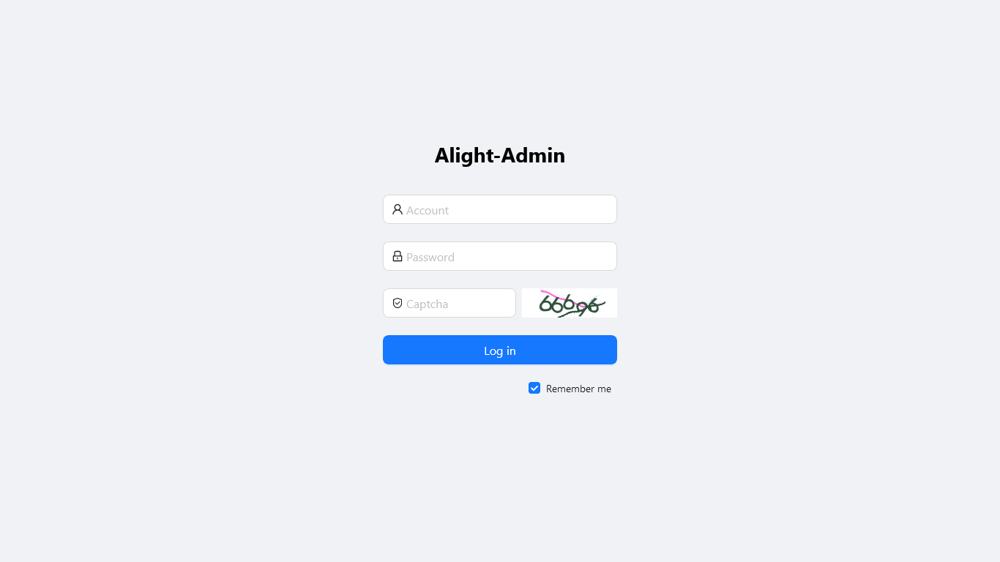
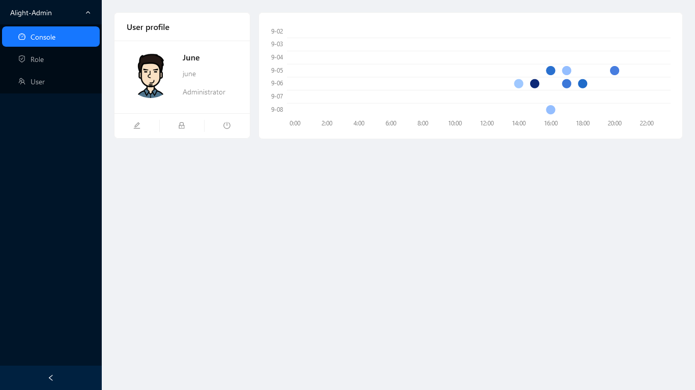
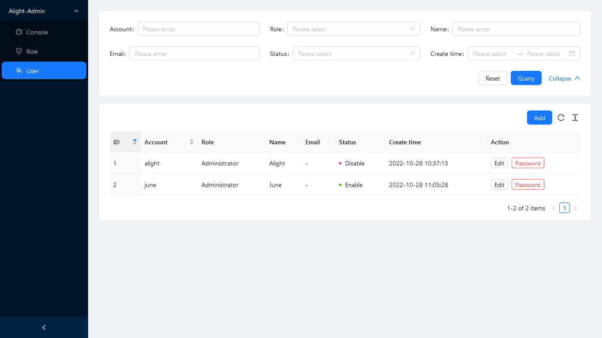
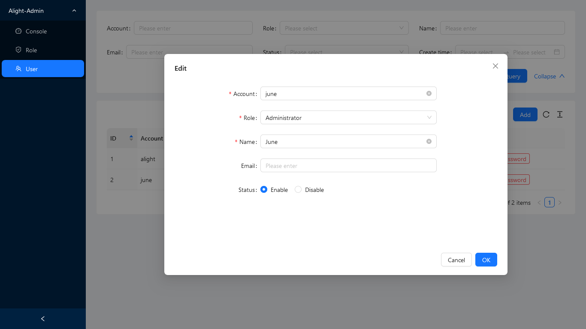
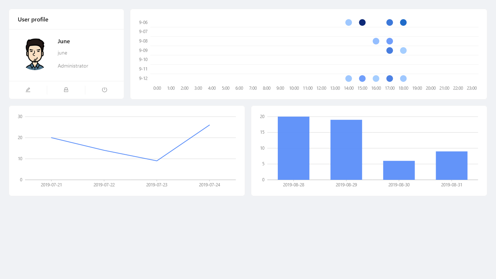

# Alight-Admin
Alight-Admin is a quick admin panel extension based on the  [Alight framework](https://github.com/juneszh/alight).





## Features
* **No front-end coding required**. Built-in **Ant Design UI** (React) components and driven by PHP interface.
* Quickly build and easily configure **CRUD** pages with Table/From render.
* Includes **authorization**, **permissions** and **user management**.
* Customizable **Charts** displayed in the console by PHP, such as **Line**, **Column**, **Pie**, etc.

## Alight Family

| Project | Description |
| --- | --- |
| [Alight](https://github.com/juneszh/alight)  | Basic framework built-in routing, database, caching, etc. |
| [Alight-Admin](https://github.com/juneszh/alight-admin)  | A full admin panel extension based on Alight. No front-end coding required.|
| [Alight-Project](https://github.com/juneszh/alight-project) | A template for beginner to easily create web applications by Alight/Alight-Admin. |

## Requirements
PHP 7.4+

## Usage
Alight-Admin can be quickly built using [Alight-Project](https://github.com/juneszh/alight-project).
### Creating Project
```bash
$ composer create-project juneszh/alight-project {PROJECT_DIRECTORY} 
```

### Initialize Admin
The following commands will build the runtime environment required by **Alight-Admin**, such as installing composer package, inserting configuration options, creating database tables, and downloading front-end resources. Please make sure the [database has been configured](https://github.com/juneszh/alight#database).
```bash
$ cd {PROJECT_DIRECTORY} 
$ composer require juneszh/alight-admin
$ composer run admin-install
$ composer run admin-download
```

### Try the CRUD
Suppose we already have a database table: **admin_user**
| Name        | Datatype  | Default           |
| ----------- | --------- | ----------------- |
| id          | SMALLINT  | AUTO_INCREMENT    |
| account     | VARCHAR   |                   |
| password    | VARCHAR   |                   |
| name        | VARCHAR   |                   |
| email       | VARCHAR   |                   |
| role_id     | TINYINT   | 0                 |
| status      | TINYINT   | 1                 |
| auth_key    | VARCHAR   |                   |
| create_time | TIMESTAMP | CURRENT_TIMESTAMP |

Now, create a php table function under controller. For example: 

File: app/controller/admin/Test.php
```php
<?php
namespace ctr\admin;

use Alight\Admin\Auth;
use Alight\Admin\Form;
use Alight\Admin\Table;

class Test
{
    public static function userTable()
    {
        // Check the role_id from logged in user
        Auth::checkRole([1]); // Here '1' means only administrators have access

        // Create the table columns and search bar
        Table::column('id')->sort('ascend');
        Table::column('account')->search()->sort();
        Table::column('role_id')->search('select')->enum([1 => 'Administrator', 2 => 'Editor']);
        Table::column('name')->search();
        Table::column('email')->search();
        Table::column('status')->search('select')->enum([1 => 'Enable', 2 => 'Disable']);
        Table::column('create_time')->search('dateRange');

        // Create the buttons
        Table::button('add')->toolbar(); // Here 'toolbar()' means this button will be placed on toolbar
        Table::button('edit');
        Table::button('password')->danger();

        // Bind the database table 'admin_user' and render table page
        Table::render('admin_user');
    }
}
```
Then, we will get the table page as:


*(In order to make the code more compact, some settings are omitted, such as: column title, status point, etc.)*

Next, we go ahead and create a form function:

```php
    public static function userForm()
    {
        // Ditto, Check the user access
        Auth::checkRole([1]);

        // Create the form fields
        Form::create('add'); // This form will bind the 'add' button
        Form::field('account')->required();
        Form::field('role_id')->type('select')->enum([1 => 'Administrator', 2 => 'Editor'])->required()->default(1);
        Form::field('name')->required();
        Form::field('email');
        Form::field('password')->type('password')->required();
        Form::field('confirm_password')->database(false)->type('password')->required()->confirm('password');

        // Create another form
        Form::create('edit')->copy('add'); // This form will bind the 'edit' button and copy fields from 'add'
        Form::field('password')->delete();
        Form::field('confirm_password')->delete();
        Form::field('status')->type('radio')->enum([1 => 'Enable', 2 => 'Disable']);

        // Create last form for 'password' button
        Form::create('password')->copy('add', ['password', 'confirm_password']);

        // Bind the database table 'admin_user' and render form page
        Form::render('admin_user');
    }
```

Then, we will get the form page as:



The last step, configure routing and side menu:

File: app/config/route/admin.php
```php
Route::get('test/user/table', [ctr\admin\Test::class, 'userTable'])->auth();
Route::any('test/user/form', [ctr\admin\Test::class, 'userForm'])->auth();
```

File: app/config/admin/menu.php
```php
Menu::item('Test');
Menu::subItem('User')->url('test/user/table');
```

Finally, the database table **user_admin** has completed **CRUD** creation. See [API LIST](#api) for more information.

## Try the Console Charts
### Create charts with built-in data.

File: app/config/admin/console.php
```php
// Here using Line charts, we support 30+ charts with AntDesign Charts
// More details please refer to : https://ant-design-charts.antgroup.com/en/examples
Console::chart('Line')->config([
    'xField' => 'date',
    'yField' => 'value',
    'height' => 200,
    'data' => [
        ['date' => '2019-07-21', 'value' => 20],
        ['date' => '2019-07-22', 'value' => 14],
        ['date' => '2019-07-23', 'value' => 9],
        ['date' => '2019-07-24', 'value' => 26]
    ]
])->grid(['span' => 12]); // Means half the width of the grid. full of 24
```
### Create charts with api data.

File: app/config/admin/console.php
```php
Console::chart('Column')->config([
    'xField' => 'date',
    'yField' => 'value',
    'height' => 200
])->grid(['span' => 12])->api('test/column'); // Define the path to the API
```

File: app/controller/admin/Test.php
```php
    public static function columnData()
    {
        // Check the user access
        Auth::checkRole([1]);

        $data => [
            ['date' => '2019-08-28', 'value' => 20],
            ['date' => '2019-08-29', 'value' => 19],
            ['date' => '2019-08-30', 'value' => 6],
            ['date' => '2019-08-31', 'value' => 9]
        ];

        // Response using the built-in json format api
        Alight\Response::api(0, null, ['data' => $data]);
    }
```

File: app/config/route/admin.php
```php
Route::get('test/column', [ctr\admin\Test::class, 'columnData'])->auth();
```

Finally, we will get the console page as:



## API
* [Alight\Admin\Table](./src/Admin/Table.php)
    * [::button()](./src/Admin/TableButton.php)
        * ->action()
        * ->batch()
        * ->color()
        * ->column()
        * ->expand()
        * ->if()
        * ->param()
        * ->role()
        * ->title()
        * ->toolbar()
        * ->url()
        * ->variant()
    * [::column()](./src/Admin/TableColumn.php)
        * ->align()
        * ->copyable()
        * ->database()
        * ->ellipsis()
        * ->enum()
        * ->fixed()
        * ->hide()
        * ->html()
        * ->role()
        * ->search()
        * ->sort()
        * ->title()
        * ->tooltip()
        * ->type()
        * ->width()
    * [::expand()](./src/Admin/TableExpand.php)
        * ->align()
        * ->copyable()
        * ->enum()
        * ->fixed()
        * ->hide()
        * ->html()
        * ->role()
        * ->sort()
        * ->title()
        * ->tooltip()
        * ->width()
    * [::statistic()](./src/Admin/TableStatistic.php)
        * ->title()
        * ->value()
    * [::summary()](./src/Admin/TableSummary.php)
        * ->avg()
        * ->precision()
    * ::render()
* [Alight\Admin\Form](./src/Admin/Form.php)
    * [::create()](./src/Admin/FormOption.php)
        * ->copy()
    * [::field()](./src/Admin/FormField.php)
        * ->confirm()
        * ->database()
        * ->default()
        * ->delete()
        * ->disabled()
        * ->enum()
        * ->grid()
        * ->hide()
        * ->placeholder()
        * ->raw()
        * ->readonly()
        * ->required()
        * ->role()
        * ->rules()
        * ->title()
        * ->tooltip()
        * ->type()
    * ::render()
* [Alight\Admin\Console](./src/Admin/Console.php)
    * [::chart()](./src/Admin/ConsoleChart.php)
        * ->api()
        * ->config()
        * ->grid()
        * ->role()
    * ::build()
* [Alight\Admin\Menu](./src/Admin/Menu.php)
    * [::item()](./src/Admin/MenuItem.php)
        * ->action()
        * ->role()
        * ->url()
    * [::subItem()](./src/Admin/MenuItem.php)
        * ->action()
        * ->role()
        * ->url()
    * ::build()

## Credits
* Composer requires
    * [juneszh/alight](https://github.com/juneszh/alight)
    * [gregwar/captcha](https://github.com/Gregwar/Captcha)
    * [symfony/var-exporter](https://github.com/symfony/var-exporter)
* UI components
    * [React](https://react.dev/)
    * [Vite](https://vitejs.dev/)
    * [Ant Design](https://ant.design/)
    * [TinyMCE 6](https://www.tiny.cloud/docs/tinymce/6/)

## License
* [MIT license](./LICENSE)